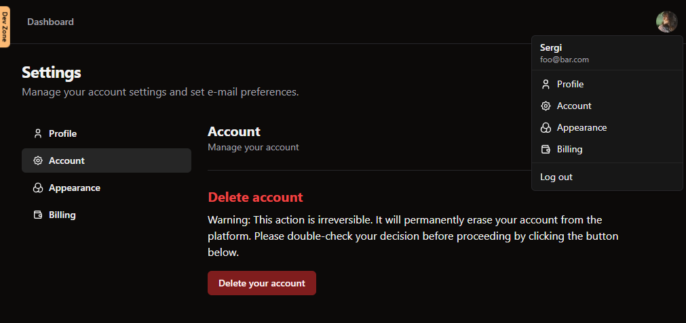

## µStarter-Kit Sass Starter based on SvelteKit

```
⚠️ This is a BETA under active development. Some feature might not work properly.

Feel free to reach me out (X - @sortegam) if you use this Starter Kit on your project. I would be happy to know about it :)
```

### Features

- Framework: SvelteKit (Typescript)
- Styling: TailwindCSS / Shadcn-svelte (https://www.shadcn-svelte.com/)
- Addons: VSCode Recommended Extensions
- Localhost with HTTPS (Using Vite config https true and vite-plugin-mkcert)
- Images: Vite-imagetools ready (Automatic Image optimization)
- Code linter: Eslint
- Code formatter: Prettier
- E2E test: Playwright
- Unit test: Vitest
- Email integration: Nodemailer (https://nodemailer.com/)
  - Integrated AWS Ses / Custom SMTP transports.
- Email Debug using: Custom FAKE_SMTP transport (to Ethereal.email)
- Icons: Iconify (https://iconify.design/)
- Auth: Lucia auth (https://lucia-auth.com/)
  - Implemented Discord / Google and Email Verification Code but supports a lot
    of auth providers.
  - Protect accounts with:
    - Max number of failed codes verification attempts.
    - Login throttling per IP and username/account basis.
- Rate Limit (https://github.com/ciscoheat/sveltekit-rate-limiter)
- ORM: DrizzleOrm (By default works with SQLITE3, but you can use any DB adapter
  like PostgreSQL or MySQL) (https://orm.drizzle.team/)
- Email templates processing: Svelte-email (https://svelte-email.vercel.app/)
- Toast system with: svelte-french-toast (https://svelte-french-toast.com/)
- Flash messages with: sveltekit-flash-message (https://github.com/ciscoheat/sveltekit-flash-message)
- Forms with: sveltekit-superforms (https://superforms.rocks/)
- Valibot as form data validator (https://valibot.dev/)
- SEO with svelte-meta-tags (https://github.com/oekazuma/svelte-meta-tags)
- Blacklisted user list + pattern onboard.
- Stripe Integration with Svelte-Stripe (https://github.com/joshnuss/svelte-stripe)
  - Stripe Elements integration.
  - [WIP] Stripe Hosted UI integration.
  - [WIP] Stripe simple Checkout Link integration.
- Sentry.io integration.

## Getting started

- Copy `.env-sample` to `.env` and fill out the env variables needed
- To install deps run: `npm i`
- To initialize db run: `npm run migrate`
- Run locally with: `npm run dev`

## Tech Nodes

If your browser complains about insecure HTTPS connection when visiting localhost, just follow
the instructions provided by https://github.com/FiloSottile/mkcert to install CA cert.

TLDR; You need to have mkcert in your computer, after that run: `mkcert -install`

## How to add Shadcn Svelte components

`npx shadcn-svelte@latest add <component>`

## Some screenshots here

<p align="center">
  
  
  
  
  
  
</p>
